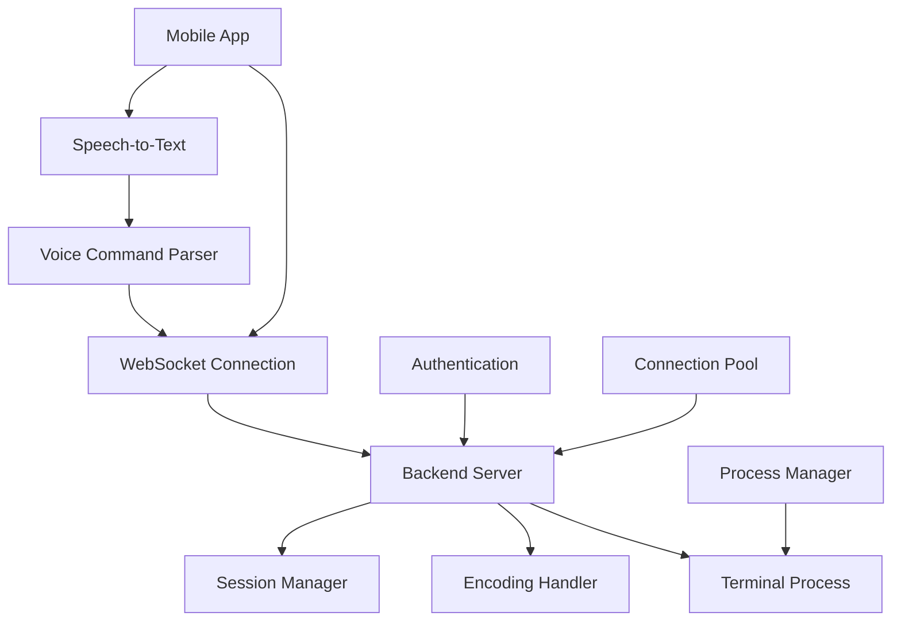

# 아키텍처 설계

## 시스템 아키텍처

### 전체 시스템 구조



### 컴포넌트 구조

#### 1. 백엔드 서버 (Node.js)

```
Backend Server
├── Express HTTP Server
│   ├── Static File Serving
│   ├── API Endpoints
│   └── Authentication
├── WebSocket Server
│   ├── Connection Management
│   ├── Message Routing
│   └── Session Handling
├── Terminal Manager
│   ├── Process Creation (node-pty)
│   ├── Input/Output Handling
│   └── Process Lifecycle
└── Encoding Handler
    ├── UTF-8 Support
    ├── Multi-byte Character Support
    └── Locale Detection
```

#### 2. 모바일 앱 (React Native)

```
Mobile App
├── UI Components
│   ├── Terminal Screen
│   │   ├── Output Display
│   │   ├── Input Handler
│   │   └── Scrolling
│   ├── Virtual Keyboard
│   │   ├── Basic Keys
│   │   ├── Special Keys (Ctrl, Alt, etc.)
│   │   └── Function Keys
│   └── Voice Input
│       ├── Speech Recognition
│       ├── Voice Button
│       └── Audio Feedback
├── Services
│   ├── WebSocket Client
│   │   ├── Connection Management
│   │   ├── Reconnection Logic
│   │   └── Message Handling
│   ├── Speech Service
│   │   ├── Voice-to-Text
│   │   ├── Command Parsing
│   │   └── Error Handling
│   └── Storage Service
│       ├── Connection Settings
│       ├── Session Data
│       └── User Preferences
└── Utils
    ├── Encoding Utilities
    ├── Command Parser
    └── Error Handler
```

## 데이터 플로우

### 1. 일반 텍스트 입력
```
User Input → Virtual Keyboard → WebSocket Client → Backend Server → Terminal Process → Output → WebSocket → Mobile App → Display
```

### 2. 음성 명령 입력
```
Voice Input → Speech-to-Text → Command Parser → WebSocket Client → Backend Server → Terminal Process → Output → WebSocket → Mobile App → Display
```

### 3. 세션 관리
```
App Start → Authentication → Session Creation → WebSocket Connection → Terminal Process → Session Persistence
```

## 프로토콜 설계

### WebSocket 메시지 구조

```json
{
  "type": "command|output|control|auth",
  "sessionId": "uuid",
  "timestamp": "iso-string",
  "data": {
    "command": "string",
    "output": "string",
    "encoding": "utf-8|euc-kr|shift-jis",
    "metadata": {}
  }
}
```

### 메시지 타입

1. **command**: 터미널 명령 실행
2. **output**: 터미널 출력 전송
3. **control**: 제어 명령 (resize, signal 등)
4. **auth**: 인증 관련 메시지

## 보안 설계

### 1. 인증 시스템
- JWT 토큰 기반 인증
- 세션 기반 권한 관리
- 연결 시 토큰 검증

### 2. 접근 제어
- 사용자별 격리된 터미널 세션
- 명령 실행 권한 제한
- 파일 시스템 접근 제어

### 3. 데이터 보안
- WebSocket 연결 암호화 (WSS)
- 민감 정보 로깅 방지
- 세션 데이터 암호화

## 성능 최적화

### 1. 연결 관리
- 연결 풀링
- 자동 재연결 로직
- 하트비트 메커니즘

### 2. 데이터 처리
- 출력 버퍼링
- 압축 전송
- 비동기 처리

### 3. 메모리 관리
- 세션 정리
- 프로세스 모니터링
- 가비지 컬렉션 최적화

## 확장성 고려사항

### 1. 수평 확장
- 로드 밸런싱
- 세션 공유 스토리지
- 마이크로서비스 아키텍처

### 2. 기능 확장
- 플러그인 아키텍처
- 커스텀 명령 지원
- 다중 터미널 지원

### 3. 플랫폼 확장
- iOS 앱 지원
- 웹 브라우저 지원
- 데스크톱 앱 지원